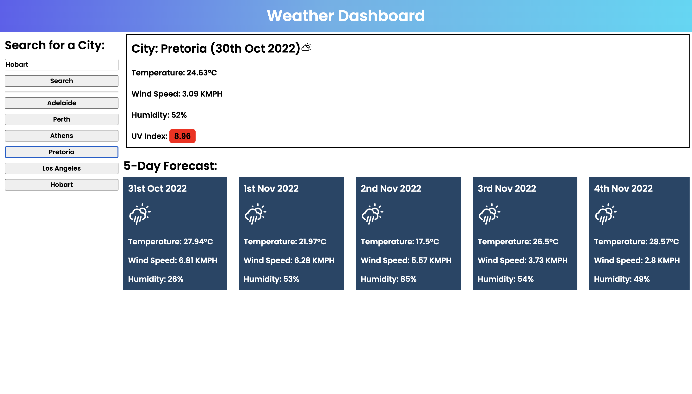

# Coding Bootcamp Week 6 Challenge - Weather Dashboard

## Description

This weeks challenge was to create a webpage to print current and future weather information. The webpage accepts user input for a city and prints out the relevant information. This webpage is powered by the OpenWeather API.

## Built With

* HTML
* CSS
* JavaScript
* [OpenWeather API](https://openweathermap.org/)

## Usage

To access this website, follow the link below to view the webpage. Input a city into the input and wait for the weather information to be printed. Input multiple cities and see all of them put into a list below the input. Click on any of them and the relevant information will be printed.

Below is the link to the webpage

https://brodie02.github.io/bootcamp-challenge6/

## Credits

Made by [Brodie Marshall](https://github.com/brodie02)

---